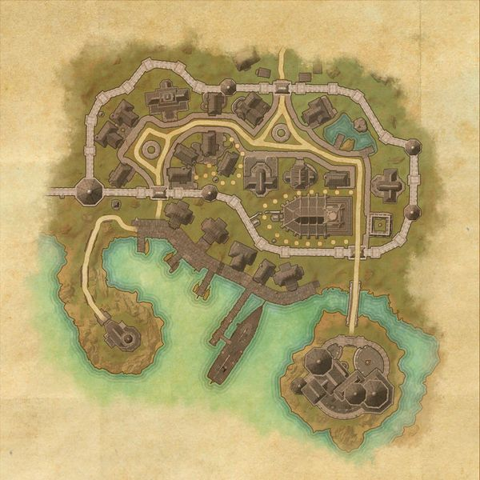
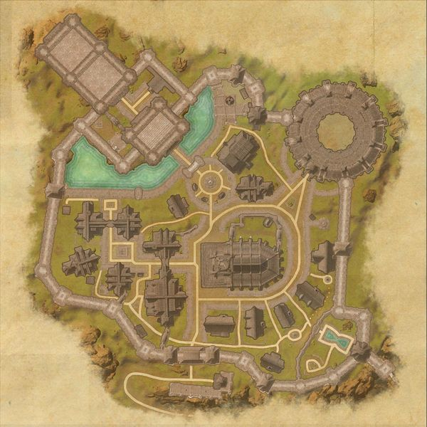
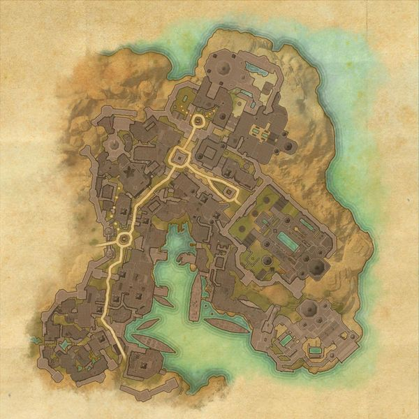
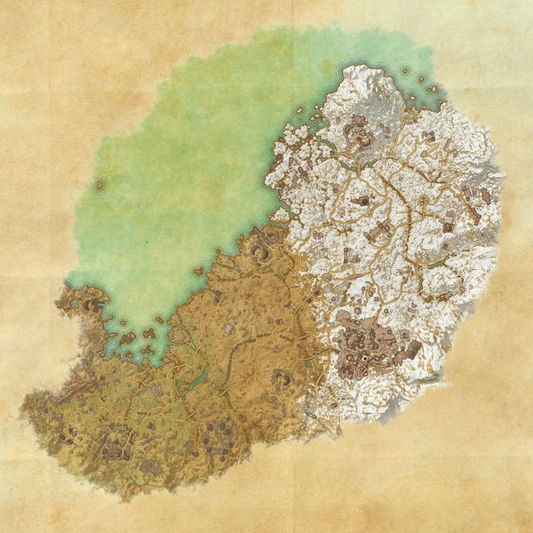

#公會榮耀
##活動獎勵
### 每日任務盒
每天一次，打活動地區每日任務 雙倍獎勵盒
### 最終BOOS盒
帝都監獄 白金塔 漩渦競技場
## 帝都行商与活动兑换券
在“公会荣耀庆典”期间，你可以在每天首次完成以下活动后获得两张活动兑换券：
- 沃斯加的每日洞穴与世界Boss任务
- 修之克星的每日洞穴、世界Boss与盗贼公会任务
- 黄金海岸的每日洞穴、世界Boss与黑暗兄弟会任务
- 帝都的每日任务
- 洛克汗的巨口每周试炼任务
- 在帝都击杀并搜刮扫荡者
- 在帝都下水道击杀并搜刮冷港精英守卫
- 击杀并搜刮帝都监狱和白金塔的最终Boss
- 击杀并搜刮漩涡竞技场的最终Boss
到活动结束为止，你总共可以获得26张活动兑换券！但请注意，你同一时间只能携带12张兑换券。

盜賊公會 黑暗兄弟會 任務 雙倍箱子
活動地圖 採集 雙倍
PVP 帝都 洞穴 BOSS 公共地下城 BOSS  額外獎勵
其中4人副本 白金塔 帝都監獄 12人副本..雙倍掉落

單人競技場 漩渦競技場 雙倍掉落
## 黃金海岸
這張地圖有兩個每日任務領取點
### 每日任務位置

## 修之克星
這張地圖有兩個每日任務領取點
### 每日任務位置

## 帝都 
這張地圖有一個每日任務領取點
### 每日任務位置

### 與活動有關的
- 地下城
  - [帝都監獄(LV45)](ICP.md)
  - [白金塔(LV45)](WGT.md)

## 沃斯加

沃斯加（Wrothgar）是位於高岩東北部、風暴港以北的一個地區。
這張地圖有兩個每日任務領取點．

