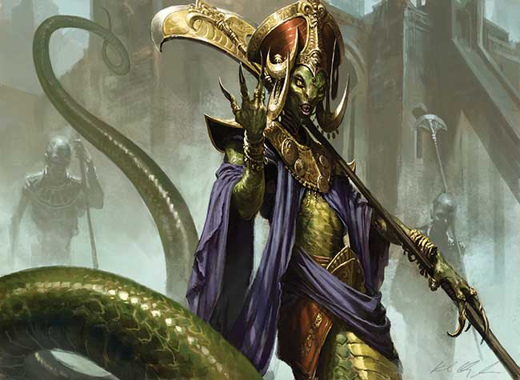

## 序章
### 第二紀元黎明

第一紀元末期，雷曼帝國正在進行泰姆瑞爾大一統戰爭最後部分，向最後一塊尚未納入帝國版圖的晨風進軍，與審判席統治的晨風交戰持續了八十年，最終審判席因為一些原因提出了和帝國的和談。
雷曼三世皇帝在和談期間遭到晨風刺客組織莫拉格堂暗殺，包括他的子嗣無一倖免，帝國皇室後繼無人，龍火失去傳承，王權被帝國來自遙遠阿卡維爾的蛇人宰相 Versidue-Shaie 篡奪，第一紀元終結，為後來的帝國大亂埋下禍根。

### 第二紀元開始
蛇人宰相 Versidue-Shaie 篡權遭遇挫折，帝國各地紛紛起兵反對他的統治，在漫長的時間之後蛇人宰相以殘酷手段平息了各地反對他的勢力，各地領主的私兵也因此被廢除，整個大陸只有帝國軍團留存作為常備軍。

### 第二紀元324年
這位統治帝國三百餘年的殘暴篡權者 Versidue-Shaie 被莫拉格堂殺了，蛇人宰相的兒子 Savirien-Chorak 即位並恢復了各地王國領主可以自行建立軍隊的權力。
由於這幾百年里莫拉格堂刺殺王室的名聲原來越大引起了各地掌權者的恐慌，莫拉格堂在泰姆瑞爾除了晨風以外的地區均被列為非法組織受到封鎖， 黑暗兄弟會隨即誕生。

### 人物小事记
第二紀元418年 安博納.尚恩出生。
第二紀元430年 蛇人宰相的兒子Savirien-Chorak也被刺客殺了，帝國徹底失去統治者，泰姆瑞爾大亂。
第二紀元465年 安博納.尚恩成為了殘餘帝國的元老院議長。
第二紀元521年 艾默里克在途歇城出生。
