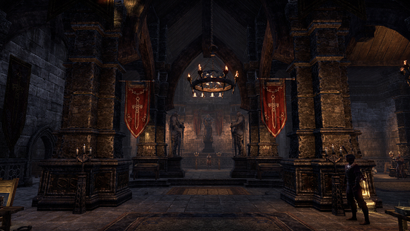
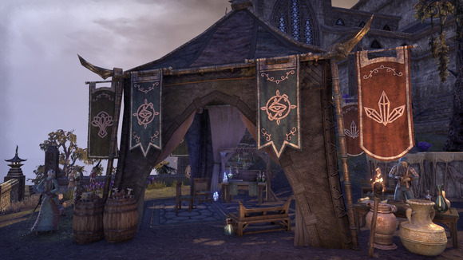
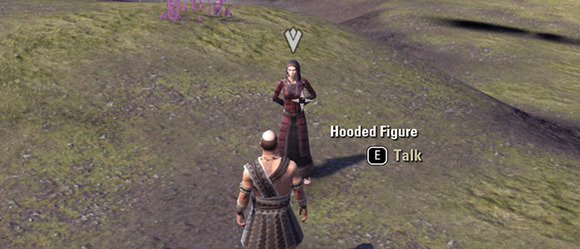
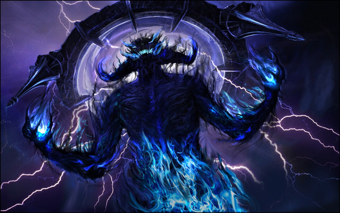
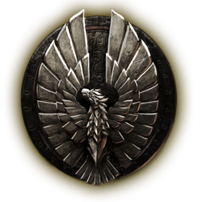
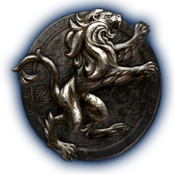
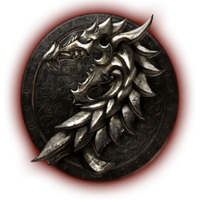
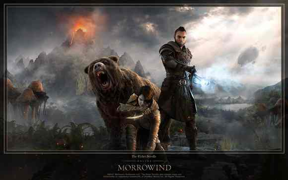
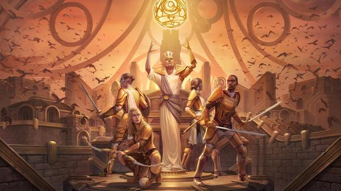
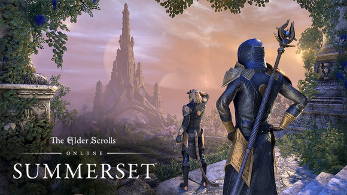

# 前言
在開始將之前，我想先說明一下，這個基礎遊戲，第一時間弧線，遊戲大致分為三種主線，世界主線也就是推動全部世界事件的發生，陣營主線也就是基礎遊戲宣傳的三陣營劇情，公會主線指的主要是法師公會和戰士公會主線（不包含無畏者，盜賊，塞伊克等等）。三條主線互相穿插，必須三條主線同時推進才能完成基礎遊戲。
以下是法師工會和戰士公會的旗幟，每次做到一個新的基礎遊戲地圖的時候最好都去當地的兩會遛一遛，說不定會有NPC找你說話。

每個陣營都有新手初始的出生位置。
這裡強烈推薦新手做新手教學。 在選擇地點之前，請先確定好自己的陣營，
## 新手島
現在開始我會介紹第一世界弧線的劇情順序，新手教程玩家則是在確認自己的陣營以後，直接利用傳送門去自己的新手島。
- 先祖神州 柯娜西的居所  
- 匕落聯盟 斯特羅斯邁凱-貝庭克  
- 黑壇心公約 暗岩島-佛耶之石 

在完成自己陣營的新手島以後，接下來你會去到自己陣營的第一個大城市，然後去尋找一個兜帽女子開啟自己的世界任務(冷港懺悔者任務)

- 先祖神州 奧瑞頓>弗柯爾之盾(奧瑞東南方的港口)  
- 匕落聯盟 格林納巴>匕落城  
- 黑壇心公約 石墬>達文之守望(石墜東邊港口) 

# 第一部 魔拉格·波爾的位面融合
魔拉格·波爾（Molag Bal）大君的泰姆瑞爾紮根計劃（Molag Bal's Planemeld）  

<small>魔拉格·波爾</small>

## 陣營地圖的順序
以下為接下來全部陣營地圖的順序：

<small>先祖神州</small>
 柯娜西的居所>奧瑞頓>格拉特森林＞綠蔭＞高崖岩嶺＞魂殤之地  

<small>匕落聯盟</small>
斯特羅斯邁凱>貝庭克>格林納巴＞風暴港＞碎裂山峰＞阿里克爾沙漠＞班科萊  

<small>黑壇心公約</small>
暗岩島>佛耶之石>石墬>迪莎安＞影沼＞東境＞裂谷  

*理論上每個地圖直接都有銜接任務讓你直接跟著任務走，但有時候你完全可以自己步行/坐船至下一個地圖，因為這個遊戲全部地圖都是相通的。
*在到達第二個區域的時候，可以將法師工會和戰士公會的主線做一做，同時前往下一個區域的主線。
## 世界主線
世界主線圍繞避難所劇情。最終討伐魔拉格·波爾（Molag Bal）。避難所先知為任務觸法點。
## 公會
依劇情推進，每張地圖都會有戰士以及法師工公會，當公會任務完成後，也會推往下一張地圖。
## 支線
如果做支線任務NPC會影響該章節的最後一章。
## 建議流程
將世界主線推進到三方和平＞完成陣營線加雙公會主線＞繼續世界線進入冷港＞討伐莫拉格巴爾。
## 另一種流程
陣營任務線完成後＞完成世界主線＞避難所（卡德維爾的金銀杯）  
# 第一部（DLC）
- 荒崖(平息星辰間的戰爭)
發生在世界主線以後的事，主角去荒崖處理邪教徒以及星辰之間的叛亂
- 帝都(PVP區域)
有兩個副本White Gold Tower以及Imperial City Prison，發生在莫拉格侵略的中途，主要是介紹一下PVP地圖以及貨幣，強烈建議新手不要去，裡面很多PVP狂人專門殺去撿垃圾的新手，以此搶奪貴重的貨幣。
- 獸人城奧新紐姆（狂扁媽寶國王）
算是匕落聯盟外傳和主線沒關係，但是強烈先做一下，今年最新的湮滅之門有獸人城重新出場的小伙伴。
*劇透：如果在世界主線結尾選擇不獻祭，獸人城結尾有隱藏彩蛋
- 盜賊公會（黑暗兄弟會）
完全可以當作兩個獨立的劇情來做和主線無任何關係，有個後面劇情NPC會出場，建議在去晨風之前先做了。
- 西里斯之影 
兩個副本DLC，魔神戰爭的伏筆副本，可以做做。 Ruins of Mazzatun蚱蜢屯廢墟以及Cradle of Shadows暗影之源
# 第二部 神魔戰爭

- 序章一 失蹤的先知(免費DLC)  
第一部曲 晨風-瓦登費爾  
晨風後面有兩個DLC副本，沒啥劇情聯繫，可以做做，Bloodroot Forge和Falkreath Hold。

- 序章二 刀與長影(免費DLC) 
第二部曲 發條城  

在做完發條城DLC以後，將會是有一個和章節劇情沒關係的副本DLC，Dragon Bones龍骨DLC包括兩個副本Fang Lair與Scalecaller Peak。沒劇情影響。

- 序章三 透過黑暗的面紗(免費DLC)  
第三部曲 夏暮島  

# 第二部（DLC）
- 獵狼者
兩個獨立劇情的副本[犧牲進行曲]和[月亮獵人城堡]。
- 序章任務  
- 幽暗沼澤 
記得先去做兩個序章任務[殘酷的競爭]以及[被詛咒的骷髏] 
- 憤怒之石  
這個副本DLC的兩個副本分別是[馬拉塔深處]和[霜穹]注意這次的兩個副本DLC是和接下來的龍騰紀元有劇情連結的，建議提前先做。
# 第三部 龍騰紀元
- 序章任務 惡魔武器  
- 序章任務 巨像大廳
北艾斯維爾  
然後在完成北愛斯維爾章節的劇情後就是一個副本DLC，[破鱗者]DLC包括兩個外傳似的副本，[穆恩格雷夫·費恩]和[馬塞洛克的巢穴]。

- 序章任務 龍的傳承   
- 序章任務 賈達裡號角， 
南艾斯維爾
# 第四部 天際省的黑暗之心
- 序章任務 女巫團的陰謀  
天際省西部  

- 序章任務 鴉守調查  
馬卡斯
# 第五部 黑木
這裡強力建議在做黑木主線之前先把支線全部做完,主線後面有彩蛋.

- 序章任務 凡人的觸碰    
黑森林  
- 序章任務 末日降臨    
死地

