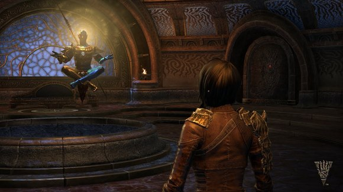
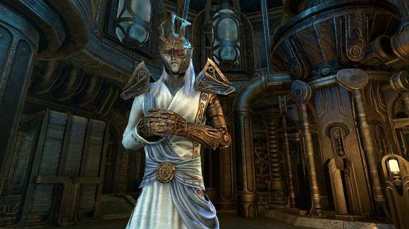
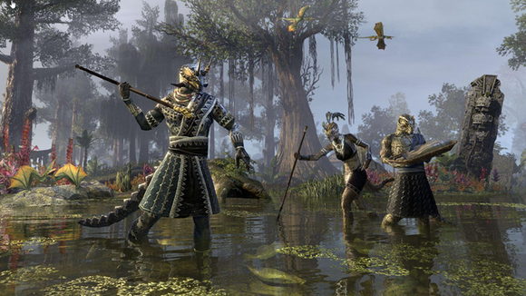
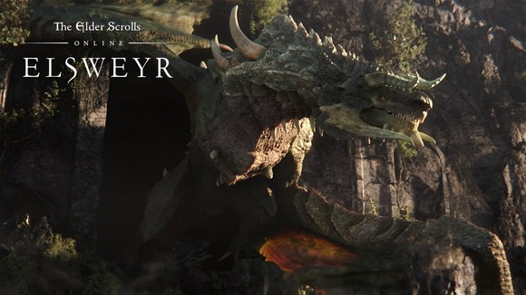
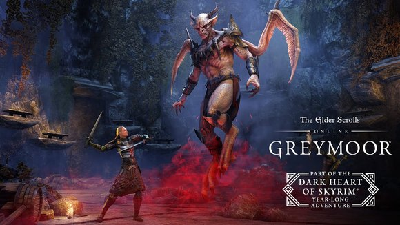

# 前言
在開始將之前，我想先說明一下，這個基礎遊戲，第一時間弧線，遊戲大致分為三種主線，世界主線也就是推動全部世界事件的發生，陣營主線也就是基礎遊戲宣傳的三陣營劇情，公會主線指的主要是法師公會和戰士公會主線（不包含無畏者，盜賊，塞伊克等等）。三條主線互相穿插，必須三條主線同時推進才能完成基礎遊戲。
以下是法師工會和戰士公會的旗幟，每次做到一個新的基礎遊戲地圖的時候最好都去當地的兩會遛一遛，說不定會有NPC找你說話。

每個陣營都有新手初始的出生位置。
這裡強烈推薦新手做新手教學。 在選擇地點之前，請先確定好自己的陣營，
## 新手島
現在開始我會介紹第一世界弧線的劇情順序，新手教程玩家則是在確認自己的陣營以後，直接利用傳送門去自己的新手島。
- 先祖神州 柯娜西的居所  
- 匕落聯盟 斯特羅斯邁凱-貝庭克  
- 黑壇心公約 暗岩島-佛耶之石 

在完成自己陣營的新手島以後，接下來你會去到自己陣營的第一個大城市，然後去尋找一個兜帽女子開啟自己的世界任務(冷港懺悔者任務)

- 先祖神州 奧瑞頓>弗柯爾之盾(奧瑞東南方的港口)  
- 匕落聯盟 格林納巴>匕落城  
- 黑壇心公約 石墬>達文之守望(石墜東邊港口) 

# 第一部 魔拉格·波爾的位面融合
魔拉格·波爾（Molag Bal）大君的泰姆瑞爾紮根計劃（Molag Bal's Planemeld）  

<small>魔拉格·波爾</small>

## 陣營地圖的順序
以下為接下來全部陣營地圖的順序：

<small>先祖神州</small>
 柯娜西的居所>奧瑞頓>格拉特森林＞綠蔭＞高崖岩嶺＞魂殤之地  

<small>匕落聯盟</small>
斯特羅斯邁凱>貝庭克>格林納巴＞風暴港＞碎裂山峰＞阿里克爾沙漠＞班科萊  

<small>黑壇心公約</small>
暗岩島>佛耶之石>石墬>迪莎安＞影沼＞東境＞裂谷  

*理論上每個地圖直接都有銜接任務讓你直接跟著任務走，但有時候你完全可以自己步行/坐船至下一個地圖，因為這個遊戲全部地圖都是相通的。
*在到達第二個區域的時候，可以將法師工會和戰士公會的主線做一做，同時前往下一個區域的主線。
## 世界主線
世界主線圍繞避難所劇情。最終討伐魔拉格·波爾（Molag Bal）。避難所先知為任務觸法點。
## 公會
依劇情推進，每張地圖都會有戰士以及法師工公會，當公會任務完成後，也會推往下一張地圖。
## 支線
如果做支線任務NPC會影響該章節的最後一章。
## 建議流程
將世界主線推進到三方和平＞完成陣營線加雙公會主線＞繼續世界線進入冷港＞討伐莫拉格巴爾。
## 另一種流程
陣營任務線完成後＞完成世界主線＞避難所（卡德維爾的金銀杯）  
# 第一部（DLC）
- 荒崖(平息星辰間的戰爭)
發生在世界主線以後的事，主角去荒崖處理邪教徒以及星辰之間的叛亂
- [DLC帝都(PVP區域)]()
有兩個副本[白金塔](https://en.uesp.net/wiki/Online:White-Gold_Tower)以及[皇城監獄](https://en.uesp.net/wiki/Online:Imperial_City_Prison)，發生在莫拉格侵略的中途，主要是介紹一下PVP地圖以及貨幣，強烈建議新手不要去，裡面很多PVP狂人專門殺去撿垃圾的新手，以此搶奪貴重的貨幣。
- [DLC 奧新紐姆]()(3000)（狂扁媽寶國王）
算是匕落聯盟外傳和主線沒關係，但是強烈先做一下，今年最新的湮滅之門有獸人城重新出場的小伙伴。
*劇透：如果在世界主線結尾選擇不獻祭，獸人城結尾有隱藏彩蛋
- [DLC 黑暗兄弟會](2000)
- [DLC 盜賊公會]()(2000)
完全可以當作兩個獨立的劇情來做和主線無任何關係，有個後面劇情NPC會出場，建議在去晨風之前先做了。
- [DLC 希思特的暗影]()(1500)
兩個副本DLC，魔神戰爭的伏筆副本，可以做做。[马扎顿遗迹](https://en.uesp.net/wiki/Online:Ruins_of_Mazzatun)以及[暗影摇篮](https://en.uesp.net/wiki/Online:Cradle_of_Shadows)
# 第二部 神魔戰爭

- 序章一 [失蹤的先知](https://en.uesp.net/wiki/Online:The_Missing_Prophecy)(免費)  
- 第一部曲 晨風-瓦登費爾(免費DLC) 

- [DLC 瑞馳號角]()(1500)
有兩個DLC副本，沒啥劇情聯繫，可以做做，[血根熔爐](https://en.uesp.net/wiki/Online:Bloodroot_Forge)和[福克瑞斯要塞](https://en.uesp.net/wiki/Online:Falkreath_Hold)。

- 序章二 [刀與長影](https://en.uesp.net/wiki/Online:Of_Knives_and_Long_Shadows)(免費) 
- 第二部曲 發條城(2000)

在做完發條城DLC以後，將會是有一個和章節劇情沒關係的副本DLC
- [DLC 龍骨]()(1500)
包括兩個副本[獠牙巢穴](https://en.uesp.net/wiki/Online:Fang_Lair)與[喚鱗者之巔](https://en.uesp.net/wiki/Online:Scalecaller_Peak)。沒劇情影響。

- 序章三 [透過黑暗的面紗](https://en.uesp.net/wiki/Online:Through_a_Veil_Darkly)(免費)  
- 第三部曲 夏暮島(已購買)

# 第二部（DLC）
- [DLC 獵狼人]()(1500)
兩個獨立劇情的副本[加入希爾辛的偉大狩獵](https://en.uesp.net/wiki/Online:March_of_Sacrifices)和[月狩要塞](https://en.uesp.net/wiki/Online:Moon_Hunter_Keep)。
- 序章任務 [殘酷的競爭](https://en.uesp.net/wiki/Online:Ruthless_Competition)(免費)  
- 序章任務 [被詛咒的骷髏](https://en.uesp.net/wiki/Online:The_Cursed_Skull)(遊戲內任務)
- [DLC 幽暗沼澤]()(2000)

- [DLC 怒靈石]()(1500)  
這個副本DLC的兩個副本分別是[馬拉塔深淵](https://en.uesp.net/wiki/Online:Depths_of_Malatar)和[冰霜宝库](https://en.uesp.net/wiki/Online:Frostvault)注意這次的兩個副本DLC是和接下來的龍騰紀元有劇情連結的，建議提前先做。
# 第三部 龍騰紀元
- 序章任務 [惡魔武器](https://en.uesp.net/wiki/Online:The_Demon_Weapon)(免費) 
- 序章任務 [巨像大廳](https://en.uesp.net/wiki/Online:The_Halls_of_Colossus)(遊戲內任務)

北艾斯維爾  
然後在完成北愛斯維爾章節的劇情後就是一個副本DLC
- [DLC 斷鱗者]()()
包括兩個外傳似的副本，[月墓古廟](https://en.uesp.net/wiki/Online:Moongrave_Fane)和[馬塞洛克的巢穴](https://en.uesp.net/wiki/Online:Lair_of_Maarselok)。
在完成這兩個副本之後，把兩個接下來的DLC序章任務給做了
- [DLC 龍之要塞]()(2000)
- 序章任務 [龍衛的傳承](https://en.uesp.net/wiki/Online:The_Dragonguard%27s_Legacy)(免費)   
- 序章任務 [賈達裡號角](https://en.uesp.net/wiki/Online:The_Horn_of_Ja%27darri)(遊戲內任務)
也就是南愛斯維爾地圖DLC的序章 。
 
南艾斯維爾
# 第三部（DLC）
在第三時段龍騰紀元和第四時間段天際省的黑暗之心期間有一個副本DLC
- [DLC 血疫风暴](https://en.uesp.net/wiki/Online:Harrowstorm)(1500)
包括兩個副本[冰境](https://en.uesp.net/wiki/Online:Icereach) 和[亵渎坟墓](https://en.uesp.net/wiki/Online:Unhallowed_Grave)這兩個副本是和下一個時間段的主線劇情有深刻關係的，所以強烈推薦完成。

# 第四部 天際省的黑暗之心
主要活動點 天際省西部 
在把
- 序章任務 [女巫團的陰謀](https://en.uesp.net/wiki/Online:The_Coven_Conspiracy)
- 序章任務 [女巫團的難題](https://en.uesp.net/wiki/Online:The_Coven_Conundrum)

兩個序章任務做完以後，就可以開始做第四時段的劇情了，也就是天際的黑暗之心。
在完成西天際Western Skyrim的章節劇情後，就是一個副本DLC
- [DLC 石與荊棘]()(1500)
包含兩個副本[石之花园](https://en.uesp.net/wiki/Online:Stone_Garden)和[荆棘城堡](https://en.uesp.net/wiki/Online:Castle_Thorn)，兩個副本的劇情均和西天際主線有關係，所以推薦有時間可以打打普通難度的本體驗副本劇情。
- [DLC 馬卡斯城]()(2000)
主要活動點 馬卡斯
兩個序章任務
- 序章任務 [鴉守調查](https://en.uesp.net/wiki/Online:The_Ravenwatch_Inquiry)
- 序章任務 [灰色委員會](https://en.uesp.net/wiki/Online:The_Gray_Council)
給做完，接下來再將瑪卡斯城地圖DLC做完以後，恭喜你，你已經完成了第四時段的全部劇情內容。
 
# 第四部（DLC）
- [DLC 野心之火]()(1500)
包括兩個副本
- [大釜](https://en.uesp.net/wiki/Online:The_Cauldron)
- [黑德雷克庄园](https://en.uesp.net/wiki/Online:Black_Drake_Villa)
這兩份副本均和湮滅之門有劇情聯繫強烈建議先做完再做黑木章節的劇情

# 第五部 湮滅之門
- [DLC 黑木]()(3500)
主要範圍 黑森林 
這裡強力建議在做黑木主線之前先把支線全部做完,主線後面有彩蛋.

- 序章任務 [凡人的觸碰](https://en.uesp.net/wiki/Online:A_Mortal%27s_Touch)   
- 序章任務 [皇帝的秘密](https://en.uesp.net/wiki/Online:The_Emperor%27s_Secret) 
- [DLC 覺醒之焰]()(1500)
 
- 序章任務 [末日降臨]()    
主要範圍 死地

# 未排順序DLC
- 命運書寫師(1500)(死靈之地前段)
- 失落深淵(1500)
- 死地(2000)
- 潮起(1500)
- 灰沼(3500)
- 焱歌(2000)

- 艾思維爾(3500)
- 高島(3500)

