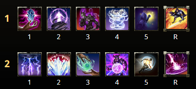

# 法系巫師
*CP 冠軍點數
*Dungeon 地城
*Trash 破壞
## 常用Dungeon Build
常规使用的四人本build我通常会选择有较高自buff能力、结合部分AOE能力的做法，即build尽可能包含AOE spam和大伤害+暴击buff，同时、因为四人本整体战斗比较零散，技能或装备上我更愿意选择【用起来更简便】的内容
### 装备：

对于巫师而言，宠物能提供相当部分占比的伤害，但频繁的跑动会尤其降低猴子的伤害，并且因为猴子的脉冲带控制，个别情况会对坦克控制场面造成不利影响。
### 守护石：Thief
### 技能组：

### 附魔：身体部件全蓝、首饰全法伤、武器主手火伤、副手武器伤害
除开场外不用按鸟，没有spam是因为现在火脉冲有bug打不出aoe，如修复，在有aoe的情况会把诅咒换成脉冲
如果队伍需要电池和钉子可以在无畏者mystic orb（推球）和巫师Hurricane（飓风）直接进行替换
### CP:

## 常用Trash Build
个人Trash Build的习惯是：多spam、多pre buff+dot、少进战dot，意思是开怪前能把绝大多数的buff和伤害技能开齐，开怪后只需要少量地面dot技能即可以多打aoe spam
### 装备：

三件试炼套首饰仅仅作为Minor Slayer buff的获取途径，可以选任意一效果为暴击或者武器伤害的试炼首饰代替
### 守护石：Thief

### 附魔：身体部件全蓝、首饰全法伤、武器主手电伤、副手武器伤害
### 技能组：

注意当前飓风的伤害类型bug，会在目标范围外触发到Prior，因此建议进入aoe怪堆再开
Prebuff：加速-交换-炸弹
### CP：

## 常用试炼Build（单体）：
试炼单体build绝大多数情况应当维持近战，因此通常双持主手都会因其高面板成为最佳选择，副手武器两个考量标准：aoe范围和你的技能组续航，如果因为过多本职业耐系morph技能导致缺耐，副手大剑则应该慎重选择而不是一味使用，同理，如目标不宜在一个小圆形aoe内集中，则大剑或弓的aoe效率可能不如法杖。
### 装备（不含神器）：

### 装备（双切含神器）：

### 守护石：Thief

### 附魔：身体部件全蓝、首饰全法伤、武器主手火伤+毒伤、副手武器伤害

### 技能组：

对于部分格挡需求较高的场景，我会放弃斩杀带塞伊克的元素武器

### CP：

（使用神器裤子时将Fighting Finesse替换为Thaumaturge）
## 常用试炼Build（附带AOE）：
通常用在部分除了主要目标，还附带有其他高威胁同时高血量目标的场景，这种情况通常要求在确保按时击杀的同时尽量不丢失主目标dps，或者攻击主目标的同时能够有足够aoe确保附属目标死亡。
巫师的Cleave AOE相对比较羸弱，高伤害技能基本集中在几个单体直伤上，使用Force Pulse可以当作有条件的AOE spam，前提是确保需要AOE的重要目标上有元素状态效果

### 装备：

弓或者火杖作为副手均可，弓用于解决部分情况因为5中导致的缺蓝问题

### 守护石：Thief

### 附魔：身体部件全蓝、首饰全法伤、武器主手火伤、副手武器伤害
### 技能组：

### CP：

## 后记：
法系巫师有相对较差的cleave aoe能力，因此涉及这种要求的部分难本通常我不会选用，但因为巫师整体build可以在不损失太多dps的情况下简单化，因此适合用作不是机制处理和简单场景

