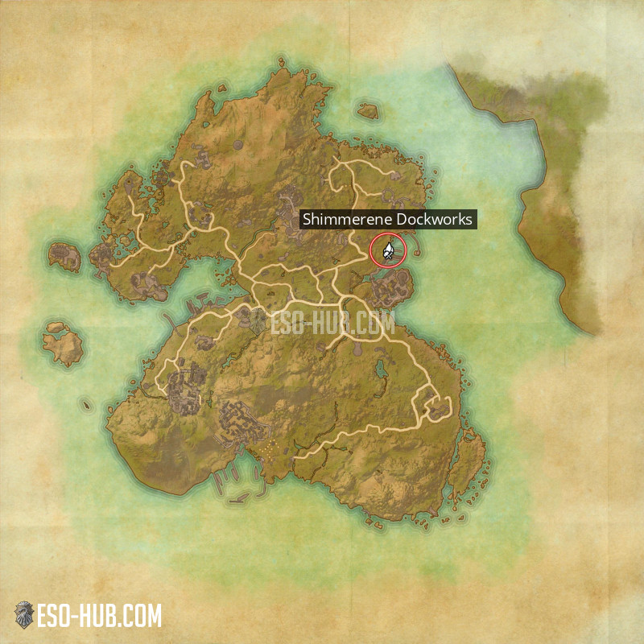
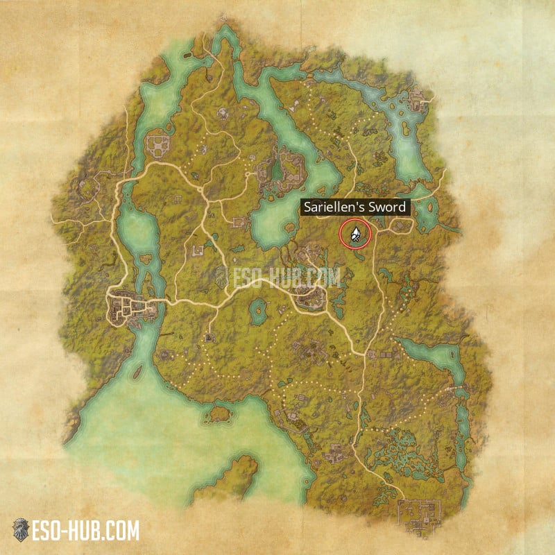

法系玩法 : 
建議穿 3中 3重, 直到開啟 中,重 技能線 , 改穿 5輕 1 中 1重 , 
這樣可以同時練到 3 條技能線
白綠裝備請賣給NPC商人, 藍紫裝備拿去工作台拆
請你好好妥善保留藥草, 藥草與道具等級無關, 所以藥草非常值錢, 每個基本都50起跳, 高消耗型的都可以賣100 ~ 300
你一定很想擴充你那小的要死的背包和銀行, 人物包包最多可以擴到 200 格, 銀行可以擴到 240 格
但是擴滿的總花費是 100 萬左右, 建議人物包包先擴到 100 格就好 (約2萬), 銀行就先別擴了
馬廄商人的第2個標籤是練馬, 分為 速度 , 耐力 , 攜帶量
速度 : 就是跑速, 速度0點時, 馬的跑速跟你不騎馬時速度一樣
耐力 : 騎上馬後, 有一個耐力條, 這個耐力條歸0時, 你受到攻擊就會摔下馬, 被攻擊和衝刺(shift) 都會消耗耐力條,
PS. 耐力條是影響摔下馬的機制, 就算耐力條歸0, 你也可以按著 shift 衝刺
攜帶量 : 這是直接增加你個人背包的空間, 靠包包商人只能擴到 140 格 , 剩下60格是要靠點馬來用
但不管怎樣, 耐力一定是最後才點的!
另外還要研發特性，不然以後沒研發過的特性無法用轉換台轉換/重製。輕重中甲，武器，珠寶都需要研發

CP160前一律不刷裝不做裝
坦/補沒有畢業裝，常用裝備都要刷，CP 300前都不建議玩，先做DD畢業裝，當DD去刷
[法系畢業套](https://www.eso-tw.com/saligia_magdps_remake/)
## 新人套裝
因遊戲特性，裝備等級影響不大，裝備經驗套裝 160 CP 以前不用換．

名稱：熟練騎手  
類型：可製作  
地點：夏暮島   
製作地點：微光碼頭(發現於夏暮島)
製作所需特色： 3  
需要 DLC：夏暮島  
可取得物品：  
  - 武器
  - 輕甲
  - 珠寶
  - 重甲
  - 中型裝甲
  

名稱：中心地帶征服者
類型：可製作
地點：黑木
製作地點：薩瑞連之劍(發現於布萊克伍德)
製作所需特性： 7
需要 DLC：黑木

可取得物品：
  - 武器
  - 輕甲
  - 珠寶
  - 重甲
  - 中型裝甲
  

副手武器 應用 練等

## 武器搭配與技能應用
BD類型 PVE DPS
- 正常BD 雙Bar
- 雙切
  - 使用兩把武器的配置，爆發與輸出皆高於重擊法，但操作難度也相對更高。另外也可能專門指不使用競技場武器的NO ARENA SETS配置，該配置是不使用競技場武器，而是使用2五件套+2怪物頭套+神器的配置
- 重擊流
  - 重擊法：也稱one bar(HA)，是以重擊為主要輸出手段的配置，任何角色都可以玩重擊法，目前常見的裝備為：中士套+風暴套+橡木戒指，並使用電杖作為武器

### 主手武器
主手武器觸發主手附魔
### 副手武器
副手武器觸發副手附魔
副手=特質 注魔+附魔 武器傷害
DPS 競技場武器
*VMA 大漩渦
- 大劍 VMA 技能 耐系 單體(強化直衝)
- 火杖 VMA 技能 法系 群體(強化火牆)
- 弓箭 VMA 技能 耐系 群體(強化箭雨)
- 弓箭 龍星 偏向單體  帶一點AOE (面板直接加330) 
- 雙持匕首 黑玫瑰(激活刀刃斗篷) 
  - 套装效果
（2件）用刀刃斗篷造成伤害后，获得幽灵斗篷，持续2秒，降低受到的伤害并提高造成的伤害6%。

閃電法杖的使用與技能搭配

## 裝備獲得以後的處理流程
1.綁定(擁有過)
2.研究(沒研究過(木工、鍛造台、制衣台、首飾))
3.拆解(可以加經驗的)
4.分解(附魔)
5.絢麗裝飾(出售)

轉化晶石(轉化特性、照)
收集的套裝越完整轉化所花費的轉化晶石越少

### 研究優先
- PVE
  - 護甲(輕) 神性
  - 護甲(中) 神性
  - 護甲(重) 強韌 加固
  - 飾品 注魔 嗜血
  - 武器 
  - 弓 精準 注魔
  - 毀滅杖 精準 注魔 充能
  - 治療杖 動力
  - 盾牌 強韌
  - 單手武器 充能 鋒銳 奈恩核心 防禦
  - 雙手武器 精準 注魔 奈恩核心
- PVP
  - 護甲 加固 合身 注魔 牢不可破
  - 武器 鋒銳 奈恩核心
  - 首飾 注魔
