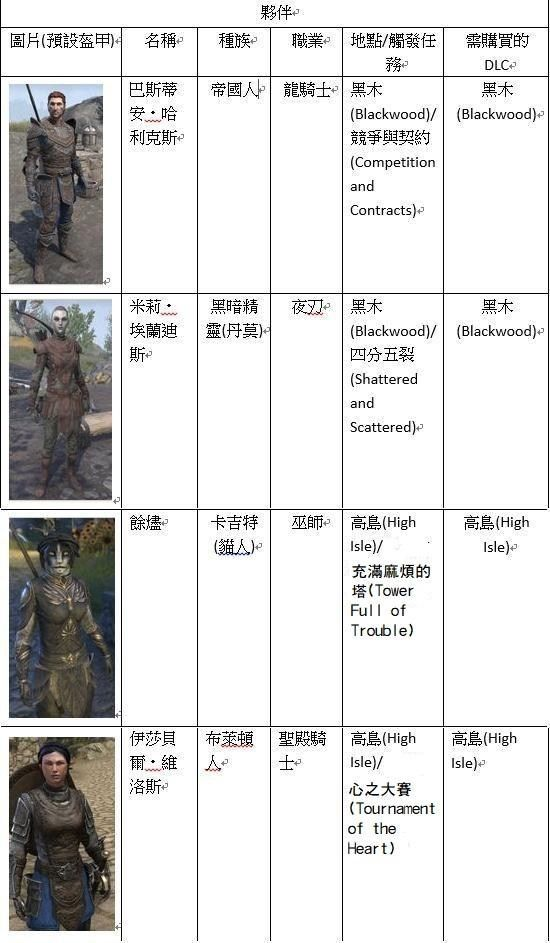
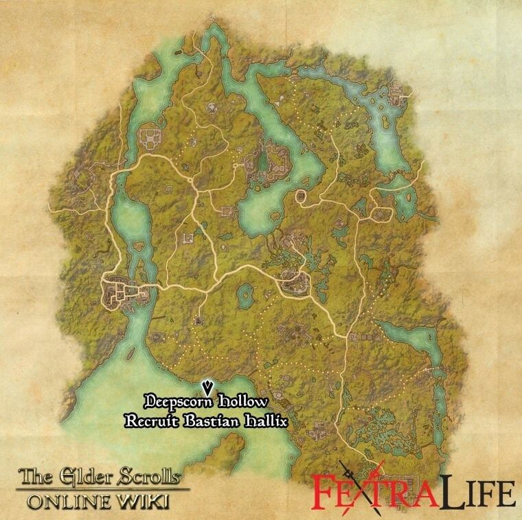
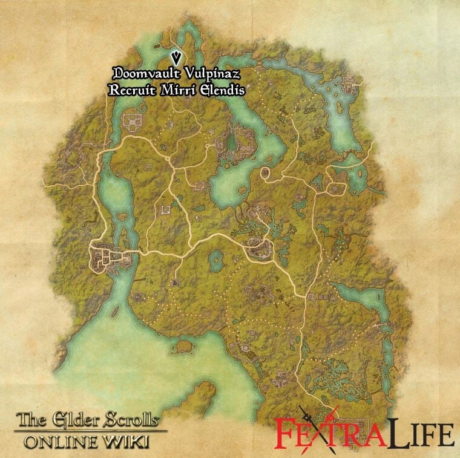
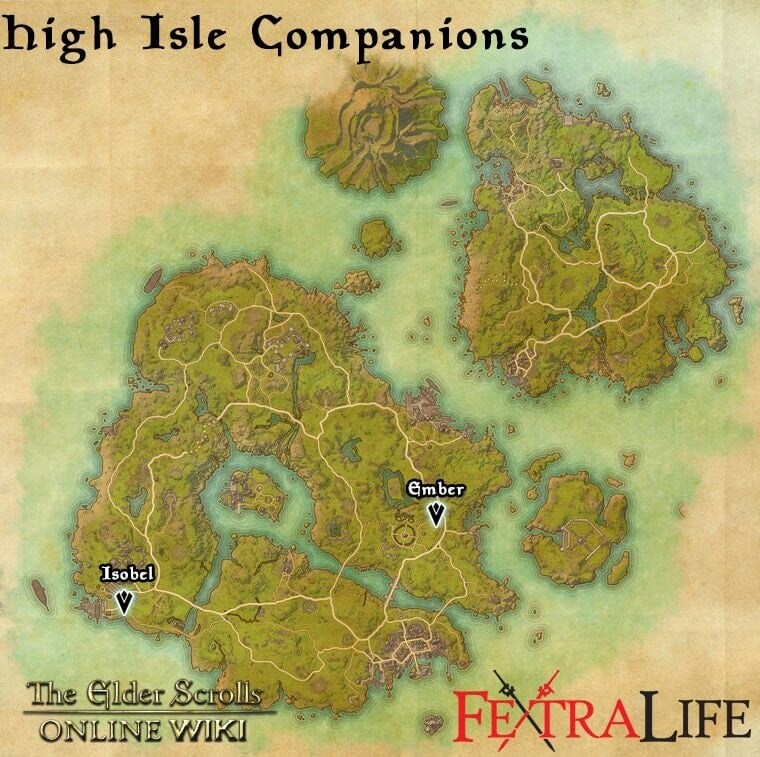

旅伴(又翻譯為夥伴、同伴、隨從)功能，主要目的是提供玩家一名可參與戰鬥的額外NPC，具備一定程度的坦/補/打能力，降低玩家的遊戲難度。

## 旅伴系統簡介：
### 夥伴選單：
與夥伴對話可打開夥伴選單，可在選單中為夥伴選擇要穿什麼裝備(與一般玩家裝備不同，屬於夥伴專屬的裝備)以及搭配技能(與一般玩家技能不同，是夥伴專屬的技能)，此外夥伴好感度提高也會解鎖相關任務。

### 戰鬥：
夥伴會在玩家戰鬥時自動攻擊並施放技能，根據裝備的武器不同，也會產生不同戰鬥風格，玩家可以自由選擇要讓夥伴擔任什麼樣的定位。

### 時裝：
夥伴也同時可以裝備時裝、坐騎等，與玩家共享一個收藏品庫

### 技能：
除了夥伴本身的職業技能外，夥伴也可以學習三大職業公會(法師、戰士、無畏者)的技能線，以及各武器、護甲的技能。不過技能同樣與玩家能學習的技能不同。獲得技能線與升等的方法，是要由玩家解三大職業公會的每日時獲得經驗值(夥伴需叫出)，或者裝備各類武器、護甲並獲得經驗。夥伴技能不需要技能點，也不會有技能等級或變形。

### 等級：
夥伴最高等級20，在20等時會解鎖專屬終極技能

目前(到高島DLC)共有4個旅伴，分為為：

#### 巴斯蒂安
##### 位置

##### 喜歡/不喜歡
|增加好感|行為|冷卻時間|
|-|-|-|
|+500|完成丟失與尋找(Things  Lost, Things Found) 巴斯蒂安的第二個任務(需要友好狀態才能開始)|僅一次|
|+500|完成家庭秘密(Complete  Family Secrets) 巴斯蒂安的第三個任務(需要完成丟失與尋找)|僅一次|
|+125|完成法師公會每日|無|
|+10|訪問陣營區域內的法師公會建築(經過大廳即可)|20小時|
|+10|訪問阿塔姆或艾薇爾(Eyevea)(兩者共用冷卻)|20小時|
|+10|完成隨機遭遇(拯救召喚師、從土匪手中救人等等)|未知|
|+5|進行古物占卜|5分鐘|
|+5|拾取一個賽伊克傳送門|未知|
|+1|殺死一名召喚暗錨的蠕蟲教徒|5分鐘|
|+1|殺死任何種類的邪教徒|5分鐘|
|+1|殺死土匪，若因殺死土匪而拯救商人則+10|未知(與完成隨機遭遇共用)|
|+1|讀一本書|15分鐘|
||||
|降低好感|行為|冷卻時間|
|-1|用起司、奶酪烹煮食物|未知|
|-5|殺死被動動物|未知|
|-5|偷竊|未知|
|-5|扒竊|未知|
|-10|被抓到偷竊或扒竊|未知|
|-25|謀殺|未知|
#### 米麗
##### 位置

#### 伊莎貝爾&安柏
##### 位置

https://forum.gamer.com.tw/C.php?bsn=25919&snA=2639